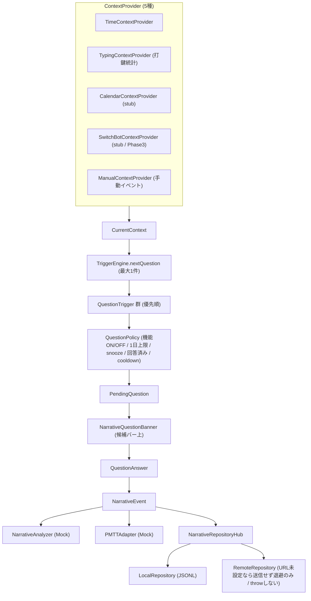

# アーキテクチャ

MozcFlickKeyboard は「ホストアプリ」と「Keyboard Extension」の 2 ターゲットから成り、共通ロジックを Shared として共有します。かな漢字変換は Mozc（C++）を Swift から呼び出して実現し、Mozc 未ビルド時は同一プロトコルのローカルスタブへ差し替えて動作します。

---

## 1. 全体構成

```
┌─────────────────────────────┐        ┌──────────────────────────────┐
│  ホストアプリ (App)          │        │  Keyboard Extension (Keyboard) │
│  - 設定 UI                   │        │  - 12キーフリック UI           │
│  - ユーザー辞書管理          │        │  - 入力 → 変換 → 確定          │
│  - キーボード有効化の案内     │        │  - UITextDocumentProxy 反映     │
└──────────────┬──────────────┘        └───────────────┬──────────────┘
               │                                        │
               └──────────────┬─────────────────────────┘
                              ▼
                 ┌──────────────────────────┐
                 │  Shared (共通 Swift)      │
                 │  - JapaneseConversionEngine（プロトコル）
                 │  - ConversionResult/Candidate/Segment
                 │  - AppConfig（App Group）
                 │  - UserDictionary（Entry/Store）
                 │  - KanaTable / KanaTransform / KeyLayout
                 └────────────┬─────────────┘
                              ▼
        ┌───────────────────────────────────────────────┐
        │  変換エンジン実装                                │
        │  ┌──────────────────┐  ┌───────────────────────┐│
        │  │ LocalStubEngine   │  │ MozcConversionEngine   ││
        │  │ (純 Swift スタブ) │  │  ↓ ObjC++ ブリッジ     ││
        │  └──────────────────┘  │  ↓ Mozc C++ (session)  ││
        │                        └───────────────────────┘│
        └───────────────────────────────────────────────┘
```

- App / Keyboard は Shared を通じてのみ変換エンジンに触れ、Mozc の C++ 型は一切露出しません。
- `MOZC_AVAILABLE` の有無で `MozcConversionEngine` / `LocalStubEngine` を切り替えます。

---

## 2. 各ターゲットの責務

| ターゲット | 責務 | 触れないもの |
| --- | --- | --- |
| **App（ホスト）** | 設定（トグル入力・学習・プライベートモード等）、ユーザー辞書 CRUD・CSV/JSON 入出力、キーボード有効化の導線 | UITextDocumentProxy（拡張のみ） |
| **Keyboard（拡張）** | フリック UI、入力イベント → 変換エンジン → 確定文字列を `UITextDocumentProxy` へ反映、地球儀キー切替 | メモリ・API 制約（下記制約 doc） |
| **Shared** | 変換プロトコル・値型、App Group アクセス、かな変換テーブル、ユーザー辞書ストア | UIKit 依存の最小化 |
| **MozcBridge** | Swift ↔ C++ 境界（ObjC++）。Mozc session を包む | Swift へ C++ 型を漏らさない |

---

## 3. Swift ↔ ObjC++ ↔ C++ 境界

Mozc は C++ で書かれているため、Swift から直接呼べません。以下の 3 層で隔離します。

1. **Swift 層**: `MozcConversionEngine`（`JapaneseConversionEngine` 準拠）。入出力は純 Swift 値型（`ConversionResult` 等）。
2. **ObjC++ 層（MozcBridge）**: `.mm` ファイル。Swift から見える Objective-C クラス（例: `MozcSessionBridge`）を公開し、内部で Mozc の C++ API（`mozc::Session` 等）を呼ぶ。Swift へは `NSString` / プリミティブ / 単純な struct のみ返す。
3. **C++ 層（Mozc）**: `out/mozc` にビルド済みの静的ライブラリ / XCFramework。

境界での型変換方針:

- 文字列は UTF-8（C++）↔ `NSString`/`String`（Swift）。
- 候補配列は ObjC++ 側で `NSArray<NSDictionary>` 等に詰め替え、Swift 側で `ConversionCandidate` に写像。
- Mozc の protobuf メッセージ（`commands::Output` 等）は境界を越えさせない。

---

## 4. Mozc セッション管理

- Keyboard Extension のライフサイクルに合わせて 1 つの Mozc セッションを保持。
- 起動時に一度だけ初期化（辞書ロード）。初期化コストは [performance.md](performance.md) の目標値を参照。
- 入力ごとに `insert` / `requestConversion` を session へ委譲。`commit` でセッションのコンテキストをリセット。
- 拡張がメモリ都合で破棄・再生成される場合に備え、辞書・学習は App Group の永続層へ保存し、セッションは再初期化で復元。

---

## 5. 状態遷移

`JapaneseConversionEngine` を軸にした入力状態:

```
     ┌────────────┐  insert / deleteBackward   ┌───────────────┐
     │  Empty      │ ─────────────────────────▶ │  Composing     │
     │ (composition│ ◀───────────────────────── │ (かな未確定)   │
     │  = "")      │       commit / reset        └──────┬────────┘
     └────────────┘                                     │ requestConversion
            ▲                                            ▼
            │ commit（確定文字列を proxy へ）      ┌───────────────┐
            └──────────────────────────────────── │  Converting    │
                     cancelConversion              │ (文節・候補)   │
                     （Composing へ戻る）           └───────────────┘
```

- **Empty → Composing**: `insert` でかな追加。
- **Composing → Converting**: `requestConversion`（`isConverting=true`、`segments` 生成）。
- **Converting 内**: `selectCandidate` / `moveFocus` / `resizeFocusedSegment` で候補・文節を操作。
- **Converting → Composing**: `cancelConversion`（composition 保持）。
- **→ Empty**: `commit`（確定文字列を返し内部リセット）または `reset`。

拡張側 UI（`KeyboardViewController`）は `UITextDocumentProxy` に marked text API が無いため、未確定文字列を `pendingComposition` に自前保持し、確定時にまとめて `insertText` します。

---

## 6. 永続化

| データ | 形式 | 場所 |
| --- | --- | --- |
| 設定（トグル入力・学習・プライベートモード） | `UserDefaults(suiteName: AppGroupID)` | App Group |
| ユーザー辞書（`UserDictionaryEntry`） | JSON（Codable） | App Group 共有コンテナ |
| 学習データ（変換履歴） | Mozc 形式 or 独自バイナリ | App Group 共有コンテナ（プライベートモード時は書き込まない） |

ファイル保護属性は端末ロック時に保護する既定（`.completeUntilFirstUserAuthentication` 目安）。詳細は [privacy.md](privacy.md)。

---

## 7. App Group

- ID: `group.com.tanaka05.MozcFlickKeyboard`（`Config/Project.xcconfig` の `APP_GROUP_ID`）。
- アクセスは `AppConfig.appGroupID` / `AppConfig.sharedContainerURL` に集約。
- ホスト（辞書編集）と拡張（辞書参照）が同じコンテナを読み書きするため、書き込みは原子的置換（一時ファイル → rename）を推奨。

---

## 8. スレッドモデル

- UI 操作・`UITextDocumentProxy` 反映は**メインスレッド**。
- Mozc 変換呼び出しは短時間で完了する想定のため原則同期呼び出し。重い初期化（辞書ロード）は起動時のバックグラウンドで先読みし、初回入力までに完了を目指す。
- ユーザー辞書の大量入出力（CSV/JSON 数千〜万件）はバックグラウンドキューで実行し、完了後にメインで反映。

---

## 9. エラー設計

- 変換エンジンは**例外を投げない**（プロトコルは throwing でない）。異常時は空の `ConversionResult`（`.empty`）へフォールバックし、UI を壊さない。
- Mozc 初期化失敗時は `LocalStubEngine` へ自動フォールバックし、入力自体は継続可能にする。
- 永続層（辞書 I/O）は throwing。呼び出し側でユーザー通知（ホストアプリ）または握りつぶし（拡張は入力継続優先）を選択。

---

## 10. 採用ビルド方式と理由

- **採用: Bazel（bazelisk）**。理由:
  - Mozc 公式が Bazel ビルドを提供・保守しており、iOS 向けクロスビルド設定を流用できる。
  - 依存（protobuf / abseil 等）のバージョン整合を Bazel が管理し、再現性が高い。
  - CMake/GYP など旧経路より公式サポートが手厚い。
- 具体的な取得元・固定リビジョン・確認済みビルドフラグは [initial-research.md](initial-research.md) を参照（調査担当が確定値を記載）。
- 成果物（`.a` / `.xcframework`）は `out/mozc` に生成し、`scripts/generate_xcode_project.sh` が生成する Xcode プロジェクトへリンクします。

---

## 11. お天気分（Narrative）サブシステム

研究用マイクロ日記「お天気分」を Shared（`MozcFlickShared`）へ新規追加した。日常イベントを検知／推定してキーボード上部に質問バナーを1問出し、回答を `NarrativeEvent` として保存する。通常の変換・入力経路には影響を与えず、回答はホストアプリのテキスト欄（`UITextDocumentProxy`）へ挿入しない。詳細な運用・データ形状は [narrative-integration.md](narrative-integration.md)、プライバシー方針は [privacy.md](privacy.md) を参照。

処理は「Context → Trigger → Policy → Question → Banner → Answer → NarrativeEvent → Analyzer/PMTT → Repository」の一方向フローで構成する。



- **配置**: 純ロジック（Models / Catalog / State / Store / Repository / Context / Trigger / Policy / TypingMetrics / Analyzer / Recommendation / PMTT）は Shared に置き、UI（`NarrativeQuestionBanner`）は Keyboard 拡張、ダッシュボードは App に置く。UITextDocumentProxy へ触れるのは従来どおり Keyboard 拡張のみで、回答経路はそこを構造的に呼ばない。
- **状態と保存**: 出題制御状態は App Group `UserDefaults`（`NarrativeState`）、イベント本体は App Group 共有コンテナ `Narrative/*.jsonl`（`NarrativeStore`、既存 `SafetyCheckLog` と同じ流儀で throw しない）。
- **エラー設計**: 既存方針に合わせ、保存・送信のいずれも throw しない。送信は best-effort で、失敗時は `unsent_narrative.jsonl` へ退避（キーボード拡張の入力継続を最優先）。
- **フェーズゲート**: Phase 1 は朝 / 夜 / 外出 / 帰宅の Trigger のみ有効。`TypingFatigueTrigger` / `LongSessionTrigger` は同梱するが既定 `enabled=false`（Phase 2）。`SwitchBotContextProvider` は stub（Phase 3）。`NarrativeAnalyzer` / `PMTTAdapter` / `RecommendationEngine` は Mock 実装で、CoreML / LLM / FastAPI 等へ差し替え可能なプロトコル境界を用意している（Phase 4）。
