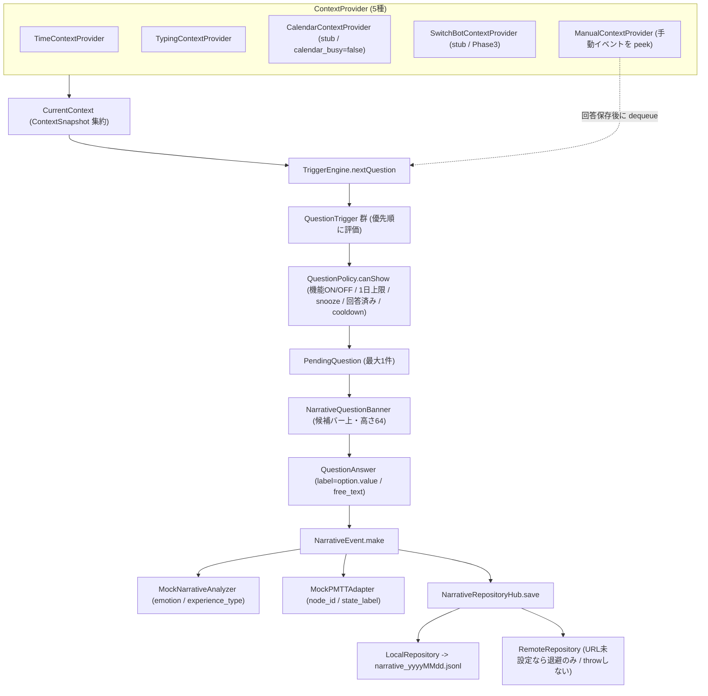

# お天気分（Narrative micro-diary）統合 完了報告

既存の MozcFlick キーボードを壊さずに、研究用マイクロ日記「お天気分」を Phase 1 として統合した。日常イベント（起床・外出・帰宅・就寝や時間帯）を検知／推定し、キーボード上部にバナー質問を1問だけ出す。ユーザーは 1〜2 タップまたは短い自由記述で回答し、回答は `NarrativeEvent` として研究データに保存される（ホストアプリの入力欄には一切挿入しない）。

対象コード: `MozcFlickKeyboard/Shared/Narrative/`, `MozcFlickKeyboard/Keyboard/Narrative/`, `MozcFlickKeyboard/App/NarrativeDashboardViewController.swift`, および変更した Keyboard / App の各ファイル。

---

### Architecture



- 通常入力はこの経路と独立して動作し、`textDocumentProxy` へは通常入力のみが反映される。回答経路は `textDocumentProxy` を構造的に一切呼ばない。
- Trigger の優先順（`TriggerEngine.makeDefault`）は `Outing > ReturnHome > Morning > NightReflection > TypingFatigue > LongSession`。`Policy.canShow` を通った最初の1件だけを採用する。

---

### 実装した Trigger 一覧

`TriggerEngine.makeDefault(state:)` が登録する 6 Trigger（優先順）。Phase 1 は上 4 つが有効、下 2 つは `enabled = false` で同梱のみ。

| Trigger | Phase | 有効 | 発火条件 | 生成 QuestionKind / event_type | external_trigger |
| --- | --- | --- | --- | --- | --- |
| `OutingTrigger` | 1 | 有効 | 手動イベント `outing`（外出した）がキューにある | `outingDestination` / `outing` | `manual_outing` |
| `ReturnHomeTrigger` | 1 | 有効 | 手動イベント `return_home`（帰宅した）がキューにある | `outingEvaluation` / `return_home` | `manual_return_home` |
| `MorningTrigger` | 1 | 有効 | 当日初回のキーボード利用 かつ 06〜10 時台（`NarrativeConfig.morningHours = 6...10`） | `morningMood` / `wake_up` | なし |
| `NightReflectionTrigger` | 1 | 有効 | 手動イベント `sleep`（寝る）がある、または 21 時以降〜翌 2 時（`nightStartHour=21` / `nightEndHour=2`） | `nightReflection` / `night_reflection` | なし |
| `TypingFatigueTrigger` | 2 | 無効（既定 `enabled=false`） | 打鍵ベースラインと現在特徴の乖離（`TypingMetrics.deviation`）。両方の特徴が揃うときのみ | `fatigueCheck` / `typing_fatigue` | なし |
| `LongSessionTrigger` | 2 | 無効（既定 `enabled=false`） | セッション継続時間が `continuousTypingThreshold = 30分` 以上 | `workState` / `long_session` | なし |

> 補足: `morningGoal` / `breakCheck` / `freeNarrative` / `interventionFeedback` は Trigger 未接続（テンプレートのみ定義済み）で、Phase 1 では出題されない。

---

### Question 一覧

全 10 種の `QuestionKind`（`QuestionCatalog.template(for:)` 定義）。`options` は表示ラベル（保存 value は括弧内）。`maxPerDay` の `max` は `NarrativeConfig.maxQuestionsPerDay = 5`。

| QuestionKind | prompt | options（label / value） | allowFreeText | cooldown | maxPerDay |
| --- | --- | --- | --- | --- | --- |
| `morningMood` | 今朝の気分はどうですか？ | 良い(good) / 普通(normal) / 少し疲れた(slightly_tired) / 悪い(bad) | false | 0 | 1 |
| `morningGoal` | 今日はどんな1日にしたいですか？ | 仕事を進めたい(work) / ゆっくりしたい(rest) / 外出したい(going_out) | true | 0 | 1 |
| `nightReflection` | 今日はどんな1日でしたか？ | 良かった(good) / 普通(normal) / 大変だった(difficult) | true | 0 | 1 |
| `outingDestination` | どこへ行きましたか？ | 仕事(work) / 買い物(shopping) / 散歩(walk) / 食事(meal) / 病院(hospital) / その他(other) | false | 0 | 5 |
| `outingEvaluation` | 今回の外出はどうでしたか？ | 良かった(good) / 普通(normal) / 疲れた(tired) / 大変だった(difficult) | false | 0 | 5 |
| `workState` | 今はどれに近いですか？ | 作業中(working) / 休憩中(break) / 疲れた(tired) / その他(other) | false | 60分 | 5 |
| `fatigueCheck` | 少し疲れていますか？ | はい(yes) / いいえ(no) | false | 60分 | 5 |
| `breakCheck` | 少し休憩しますか？ | する(yes) / しない(no) | false | 60分 | 5 |
| `freeNarrative` | 印象に残ったことはありますか？ | 仕事(work) / 家族(family) / 外出(going_out) / 食事(meal) / その他(other) | true | 0 | 5 |
| `interventionFeedback` | 今の提案は役に立ちましたか？ | 役に立った(helpful) / 普通(neutral) / 役に立たなかった(not_helpful) | false | 0 | 5 |

> 実装メモ: 選択肢を回答すると `QuestionAnswer.label` には **option の `value`**（snake_case 英語）が入る（`label` という名前だが表示ラベルではない）。`cooldown > 0` の種別（workState / fatigueCheck / breakCheck）は前回表示から 60 分未満なら再出題しない。`outingDestination` / `outingEvaluation` は「当日回答済みなら出さない」制約を免除（外出のたびに新規事象のため）。それ以外は当日1回で `maxPerDay=1` を実質的に満たす。

---

### データモデル

すべて `Codable`。保存 JSON のキーは研究ログ仕様に合わせて snake_case（`CodingKeys` で明示）。日付は `yyyy-MM-dd'T'HH:mm:ss.SSSZ`（`en_US_POSIX`、既存 `SafetyCheckLog` と同一書式）。

- **`ContextSnapshot`**: `time_of_day`（morning/afternoon/evening/night）/ `typing_active`（Bool）/ `calendar_busy`（Bool、Phase1 は常に false）/ `external_trigger`（String?）。
- **`TypingFeatures`**: `typing_speed_cpm` / `backspace_rate` / `mean_key_interval_ms` / `session_duration_sec` / `backspace_count` / `total_typed_characters` / `pause_count` / `long_pause_duration_sec`。**本文は一切含まず、時刻・回数から算出した統計量のみ**。
- **`ContextEvent`**（質問を伴わない記録。`context_yyyyMMdd.jsonl`）: `event_id` / `participant_id` / `event_type`（wake_up など）/ `detected_at` / `source`（keyboard / parent_app）/ `context`（`ContextSnapshot`）/ `typing`（`TypingFeatures?`）。
- **`PendingQuestion`**（出題中の保持オブジェクト。保存はしない）: `id` / `participantID` / `kind` / `prompt` / `options` / `allowFreeText` / `eventType` / `detectedAt` / `questionShownAt?` / `snoozeCount` / `context`。
- **`QuestionAnswer`**: `label`（選択肢の value。未選択なら nil）/ `free_text`（自由記述。無ければ nil）。
- **`NarrativeAnalysis`**: `emotion`（positive/neutral/negative）/ `experience_type`（success/failure/partial_success/neutral）/ `embedding`（Phase1 は nil）。
- **`PMTTContext`**（`NarrativeEvent.pmtt` に埋め込む）/ **`PMTTLink`**（PMTT 側から参照する対応表1件）: いずれも `node_id` / `state_label` / `transition_id`（`PMTTLink` は加えて `event_id`）。
- **`InterventionEvent`**: `id` / `participant_id` / `narrative_event_id` / `kind` / `outcome`（accepted/declined/ignored、未確定なら nil）/ `created_at`。Phase1 では未生成（`RecommendationEngine` が常に nil のため）。
- **`NarrativeEvent`**（回答済み micro-diary 1件。`narrative_yyyyMMdd.jsonl` の1行）: `question` / `answer` / `narrative` をネストする。`NarrativeEvent.make(from:answer:typing:answeredAt:)` で `PendingQuestion` + 回答から生成し、`source = "keyboard"` 固定、`summary` は選択肢 value と自由記述を ` / ` 連結した最小要約。

`NarrativeEvent` の JSON 形状（例）:

```json
{
  "event_id": "F1E2D3C4-....",
  "participant_id": "p001",
  "source": "keyboard",
  "event_type": "wake_up",
  "detected_at": "2026-09-15T07:12:03.421+0900",
  "question_shown_at": "2026-09-15T07:12:03.421+0900",
  "answered_at": "2026-09-15T07:12:09.880+0900",
  "context": {
    "time_of_day": "morning",
    "typing_active": true,
    "calendar_busy": false,
    "external_trigger": null
  },
  "question": { "kind": "morningMood", "prompt": "今朝の気分はどうですか？" },
  "answer": { "label": "good", "free_text": null },
  "narrative": { "summary": "good", "emotion": "positive", "experience_type": "success" },
  "typing": {
    "typing_speed_cpm": 210.5,
    "backspace_rate": 0.08,
    "mean_key_interval_ms": 285.0,
    "session_duration_sec": 42.0,
    "backspace_count": 2,
    "total_typed_characters": 25,
    "pause_count": 1,
    "long_pause_duration_sec": 3.1
  },
  "pmtt": { "node_id": "weekday_morning_desk_work", "state_label": "positive", "transition_id": null },
  "snooze_count": 0
}
```

---

### 変更ファイル

**新規（`MozcFlickKeyboard/Shared/Narrative/`）**

- `NarrativeModels.swift` — Codable モデル一式（`QuestionKind`(10) / `QuestionTemplate` / `QuestionOption` / `PendingQuestion` / `ContextSnapshot` / `TypingFeatures` / `QuestionAnswer` / `ContextEvent` / `NarrativeEvent`(+`.make`) / `NarrativeAnalysis` / `InterventionEvent` / `PMTTContext` / `PMTTLink` / `CurrentContext` / `ManualEvent` / `TriggerResult` / `TimeOfDay` / `NarrativeJSON`）
- `QuestionCatalog.swift` — 全 10 `QuestionTemplate` + `NarrativeConfig`（ハイパーパラメータ）
- `NarrativeState.swift` — App Group `UserDefaults` の状態（回答済み / lastShown / snooze / 初回・最終キーボード利用 / 手動イベントキュー / 打鍵ベースライン EMA / 研究設定）。キーは `NarrativeSettingsKeys`（`narrative.` 接頭辞）
- `NarrativeStore.swift` — App Group `Narrative/` への JSONL 追記・読み出し + `NarrativeExport`（JSON / CSV）
- `NarrativeRepository.swift` — `LocalRepository` / `RemoteRepository` / `NarrativeRepositoryHub`
- `Context/ContextProvider.swift` — `ContextProvider` プロトコル + `ContextFragment` + 5 実装
- `Trigger/QuestionTrigger.swift` — `QuestionTrigger` プロトコル + 6 Trigger
- `Trigger/TriggerEngine.swift` — `TriggerEngine`（`makeDefault` / `nextQuestion`）
- `QuestionPolicy.swift` — 出題可否ゲート
- `TypingMetrics.swift` — 打鍵統計の集計（本文なし）+ `deviation(current:baseline:)`
- `NarrativeAnalyzer.swift` — `NarrativeAnalyzer` プロトコル + `MockNarrativeAnalyzer`
- `RecommendationEngine.swift` — `RecommendationEngine` プロトコル + `Suggestion` + `MockRecommendationEngine`（常に nil）
- `PMTTAdapter.swift` — `PMTTAdapter` プロトコル + `MockPMTTAdapter`

**新規（Keyboard / App）**

- `Keyboard/Narrative/NarrativeQuestionBanner.swift` — 質問バナー View（選択肢 / あとで / 自由入力 / 自由記述モード / 手動イベント4ボタン）
- `App/NarrativeDashboardViewController.swift` — 親アプリ「お天気分」ダッシュボード

**変更**

- `Keyboard/Flick/KeyboardView.swift` — 候補バー上に `questionBanner`（`bannerHeightConstraint` 既定0）、infoBar に「記録」ボタン、公開 API（`showQuestion` / `hideQuestion` / `showManualEventPicker` / `setResearchDraft` / `setResearchFreeTextMode`）とコールバック
- `Keyboard/KeyboardViewController.swift` — `viewWillAppear` と 60 秒 `checkTimer` で `evaluateNarrativeTriggers()`（安否確認 `pendingCheck` が無く機能 ON のときのみ）、回答フロー、研究入力モード分岐、`TypingMetrics` feed
- `App/RootViewController.swift` — 「お天気分」行を追加し Dashboard へ遷移
- `App/SettingsViewController.swift` — 「研究設定（お天気分）」セクション（参加者ID / Backend URL / 質問機能 ON/OFF）

**テスト**

- `Tests/NarrativeTriggerTests.swift` — 朝／夜／手動外出・帰宅／snooze／翌日／機能OFF／CSV エスケープ／打鍵統計 を `now` 注入 + 一時 `UserDefaults` で検証

---

### Parent App の操作方法

1. ホストアプリを起動し、トップ（`RootViewController`）の **「お天気分」** 行をタップして `NarrativeDashboardViewController` を開く。
2. **今日の記録**: 起床 / 朝の気分 / 外出（回数と最新の行き先）/ 帰宅 / 夜の振り返り / 回答した質問数 を当日の JSONL から集計表示（`viewWillAppear` ごとに再計算）。
3. **手動イベント**: 「起きた」「外出した」「帰宅した」「寝る」をタップすると `NarrativeState.enqueueManualEvent` でキューへ積む（確認アラートを表示）。積んだイベントは次回キーボード表示時に Trigger が拾う。
4. **エクスポート**: 「JSONで書き出し」/「CSVで書き出し」をタップすると、保存済み全 `narrative_*.jsonl` を集約して一時ファイルへ書き出し、`UIActivityViewController`（共有シート）で AirDrop / ファイル保存 等ができる。
5. **研究設定**: 設定画面（`SettingsViewController`）の **「研究設定（お天気分）」** セクションで、参加者ID（既定 `p001`）/ Backend URL（既定 空）/ 質問機能 ON・OFF を編集する。値は App Group `UserDefaults` に保存され、キーボード拡張と共有される。

### Keyboard の操作方法

- **質問の出現**: キーボード表示時（`viewWillAppear`）と 60 秒ごとに Trigger を評価し、条件成立時に候補バーの上へ質問バナー（高さ 64pt）が1問だけ出る。質問が無いときはバナー高さ 0 で完全非表示（入力領域は圧迫されない）。安否確認が表示中は Narrative 質問を出さない。
- **回答**: 選択肢ボタンをタップすると即保存してバナーが閉じる。
- **あとで**: 「あとで」をタップすると 30 分後まで同じ種別を再表示しない（`snoozeInterval`）。
- **自由入力**: `allowFreeText=true` の質問で「自由入力」をタップすると研究入力モードに入り、以降のフリック入力は研究用の下書き（`researchDraft`）へ流れる（**`textDocumentProxy` には一切入力されない**）。「決定」で `free_text` として保存、「キャンセル」で選択肢表示へ戻る。
- **記録ボタン**: infoBar の「記録」を押すと手動イベント4ボタン（起きた / 外出した / 帰宅した / 寝る）を展開。「起きた」は即 `ContextEvent`（wake_up）として保存、「外出した」「帰宅した」「寝る」はキューへ積み、直後に再評価して該当質問（外出先・外出評価・夜の振り返り）を出す。

---

### Backend 起動方法

**このフェーズでは Backend は実装しない**（`RemoteRepository` の送信実装のみ用意）。Backend URL が空のあいだは、回答・文脈はすべてローカル JSONL のみに保存され、外部送信は発生しない（オフライン安全）。

将来 Backend を有効化する手順:

1. ホストアプリ設定「研究設定（お天気分）」の **Backend URL** にサーバのベース URL（例 `https://example.org`）を入力する。
2. これにより `RemoteRepository` が以下へ `POST`（`Content-Type: application/json`）する:
   - `POST <base>/api/narrative-events` — 回答済み `NarrativeEvent`（送信失敗時は `unsent_narrative.jsonl` へ退避し、`flushUnsent()` で再送）
   - `POST <base>/api/context-events` — `ContextEvent`（失敗時はローカルに残るため退避しない）
3. 将来の FastAPI MVP（計画）: 上記2エンドポイントを受ける最小サーバを立て、受信 JSON をそのまま保存する。実 `NarrativeAnalyzer`（感情・埋め込み）や PMTT 実連携もこの Backend 側で実体化する想定。

---

### 朝イベントのテスト方法

- 端末の時計を 06:00〜10:59 に設定し、その日まだキーボードを使っていない状態で入力欄を開く → 当日初回のキーボード利用として `MorningTrigger` が発火し `morningMood`（「今朝の気分はどうですか？」）が出る。
- 自動テスト: `NarrativeTriggerTests` の `testMorningFirstUseShowsMorningMood`（`now` を朝に注入、`isFirstKeyboardUseToday=true`）。

### 夜イベントのテスト方法

- 端末の時計を 21:00 以降（〜翌 02:00）にしてキーボードを開く → `NightReflectionTrigger` が `nightReflection`（「今日はどんな1日でしたか？」）を出す。
- または時刻に関係なく、infoBar「記録」→「寝る」を選ぶ → 手動 `sleep` イベントで `nightReflection` が発火する。

### 外出イベントのテスト方法

- 親アプリ Dashboard または キーボード infoBar「記録」から **「外出した」** をタップ → キューへ積まれ、次回（直後の再評価含む）キーボード表示で `outingDestination`（「どこへ行きましたか？」）が出る。
- 続いて **「帰宅した」** をタップ → `outingEvaluation`（「今回の外出はどうでしたか？」）が出る。回答保存後に手動イベントキューが `dequeue` され、同じ質問が二重に出ないようになる。

---

### 正常時に期待する出力

正常フローでは `NSLog` に `[MFK-Narrative]` 接頭辞のログが順に出る（Xcode コンソール / `Console.app` で確認）。

```
[MFK-Narrative] manual picker shown                         // 「記録」ボタンで手動イベント展開
[MFK-Narrative] manual event handled outing                 // 「外出した」をキューへ
[MFK-Narrative] question shown kind=outingDestination eventType=outing   // バナー表示
[MFK-Narrative] research-mode enter kind=outingDestination  // 「自由入力」開始時のみ
[MFK-Narrative] research-mode exit(commit) length=5         // 自由記述の決定（本文は出さない・文字数のみ）
[MFK-Narrative] appendNarrative kind=outingDestination ok=true   // JSONL 追記成功
[MFK-Narrative] answer saved kind=outingDestination emotion=positive exp=success  // 保存完了（感情/経験）
[MFK-Narrative] manual events dequeued after outingDestination   // 外出/帰宅由来なら手動イベント消費
```

朝の例（選択肢のみ）:

```
[MFK-Narrative] question shown kind=morningMood eventType=wake_up
[MFK-Narrative] appendNarrative kind=morningMood ok=true
[MFK-Narrative] answer saved kind=morningMood emotion=positive exp=success
```

「起きた」手動イベントは質問を伴わず文脈イベントとして保存される:

```
[MFK-Narrative] manual event handled wake_up
[MFK-Narrative] appendContext type=wake_up ok=true
```

保存結果は App Group 共有コンテナ `Narrative/narrative_yyyyMMdd.jsonl` に 1 行ずつ追記される（1行 = 1 `NarrativeEvent`。前掲の JSON を1行に圧縮した形）:

```
{"event_id":"...","participant_id":"p001","source":"keyboard","event_type":"wake_up","detected_at":"2026-09-15T07:12:03.421+0900","question_shown_at":"2026-09-15T07:12:03.421+0900","answered_at":"2026-09-15T07:12:09.880+0900","context":{"time_of_day":"morning","typing_active":true,"calendar_busy":false},"question":{"kind":"morningMood","prompt":"今朝の気分はどうですか？"},"answer":{"label":"good"},"narrative":{"summary":"good","emotion":"positive","experience_type":"success"},"pmtt":{"node_id":"weekday_morning_desk_work","state_label":"positive"},"snooze_count":0}
```

Backend URL を設定している場合は加えて送信結果ログが出る（未設定時はローカルのみで下記は出ない）:

```
[MFK-Narrative] post narrative-events status=200 ok=true
```

---

### 意図していない出力（異常サイン）と原因

| 症状 | 想定される根本原因 |
| --- | --- |
| 同じ質問が二重に表示される | `QuestionPolicy` の回答済み判定漏れ、または `currentPending` を評価前にクリアしているなど。正常時は `evaluateNarrativeTriggers` の `guard currentPending == nil` と `Policy.isAnswered` で防がれる。 |
| ネットワークエラーでクラッシュ | 起きてはならない。`RemoteRepository` は throw せず、失敗は `unsent_narrative.jsonl` へ退避するだけ。クラッシュしたなら送信経路が保存経路をブロックしている実装ミス。 |
| 回答後も同じ質問が出続ける | `markShown` / `markAnswered` が記録されていない（`NarrativeState` の書き込み失敗＝App Group 未設定など）。正常時は保存後に当日回答済みとなり再出題されない。 |
| 研究回答が LINE 等の他アプリに入力される | 回答経路が `textDocumentProxy` に触れている実装ミス。設計上は回答・自由記述経路（`saveAnswer` / `appendResearchText` / `commitResearchText`）は `textDocumentProxy` を一切呼ばない。研究入力中は `keyboardDidInput` も `researchDraft` へ分岐して即 return する。 |
| 通常入力の本文が Backend へ送られる | あってはならない。通常入力の本文は `SessionLogger`（ローカルのみ）が扱い、Narrative 同期対象から完全に除外されている。`NarrativeEvent` に本文フィールドは無く、`TypingFeatures` は統計量のみ。 |
| 朝なのに夜の質問（またはその逆）が出る | Trigger の時間窓バグ。`MorningTrigger` は `morningHours=6...10`、`NightReflectionTrigger` は `hour >= 21 || hour <= 2`。端末時計 / カレンダー設定を確認。 |

---

### 残課題

- **Phase 2**: `TypingFatigueTrigger` / `LongSessionTrigger` の有効化（`enabled=true`）と、打鍵ベースライン（EMA / 乖離閾値）のチューニング。`workState` / `fatigueCheck` / `breakCheck` の運用開始。
- **Phase 3**: `SwitchBotContextProvider` の実装（ドア開閉 → `OUT_DOOR` / `IN_DOOR` を `external_trigger` に寄与）、Core Location による geofence 外出検知。
- **Phase 4**: 実 `NarrativeAnalyzer`（CoreML / ローカル LLM / OpenAI 等で感情・埋め込みを算出）、`RecommendationEngine` の過去経験検索による提案生成、`PMTTAdapter` の実連携（`transition_id` を含む）、FastAPI Backend の実装。
- **Calendar 連携**: `CalendarContextProvider` を EventKit で実体化（現状は stub で `calendar_busy=false` 固定、権限要求もしない）。
- **Widget / App Intents**: 今回は「キーボードのみ」の方針で見送り。手動イベントは infoBar「記録」に集約している。
- `morningGoal` / `breakCheck` / `freeNarrative` / `interventionFeedback` はテンプレートのみで Trigger 未接続。出題導線の追加は将来検討。
